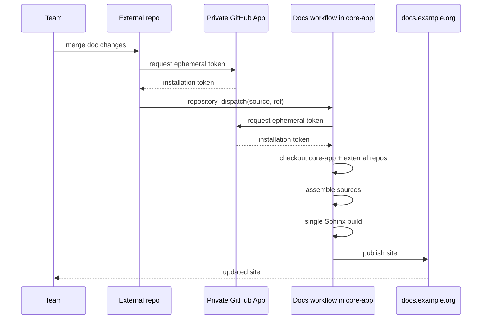

<!--
.. title: A federated documentation architecture with Sphinx
.. slug: federated-documentation-with-sphinx
.. date: 2026-04-28 01:26:03 UTC-03:00
.. updated: 2026-08-05 15:45:00 UTC-03:00
.. tags: docs, sphinx, github-actions, architecture, devops
.. category: development
.. link:
.. description: A simple architecture for publishing a single documentation site from sources maintained across multiple repositories.
.. type: text
-->

Most teams run into the same problem sooner or later: technical documentation is spread across different repositories, but the natural destination for publishing it is a single, coherent site.

A central project may have its own development docs, but also depend on operations guides, infrastructure manuals, or integration documentation that live in other repositories and are often maintained by different teams.

The question is how to publish all of it together — with consistent navigation and cross-references — without forcing the sources to be centralized as well.

The idea we've been implementing at [Fierro](https://www.fierro.com.ar/) is fairly simple: **a single published site, built with Sphinx from one main repository, but from sources maintained across several repos**.

<!-- TEASER_END -->

## The scenario

Say there's a main repo, `core-app`, that already publishes its documentation with Sphinx at `docs.example.org`.

Now we want to add two more sections:

- `operations/`, whose source lives in the `ops-infra` repo
- `integrations/`, whose source lives in the `store-connectors` repo

Why keep the sources separate? Often different teams maintain them. And it's also more useful when the docs are consumed directly from source — by humans or agents reading Markdown — if they live alongside the code.

That said, for a nicer reading experience, cross-references, and alternative output formats, we want the final site to remain a single one, with a single publication and a single domain.

## The approach

Instead of compiling each repo separately and trying to stitch HTMLs together, the cleanest approach is to assemble everything at the source level.

In the example, `core-app` remains the assembler and publisher of the complete site. `ops-infra` and `store-connectors` maintain only their own documentation sources. On every docs build of `core-app`, the workflow checks out those external repos and mounts their `docs/` directories into the tree that Sphinx will compile. In other words: sources are distributed, but publication is centralized.

## Why not compile each repo separately

A tempting alternative is to have each repo generate its own HTML and then have the main repo stitch together pre-built sites.

The problem is that this mixes already-built artifacts instead of working with sources. Integrated navigation becomes awkward, relative links get brittle, and maintaining a common theme and structure becomes significantly harder. Build decisions that — if we truly want a single site — should live in one place end up duplicated everywhere.

If the goal is **one site**, it makes sense to do **one build**.

## Keeping external repos sane

Centralizing publication doesn't mean external repos have to go blind. Each repo's `docs/` should still be able to build independently, including `core-app`'s own docs when external sources aren't available. `core-app` defines stable placeholders within its own docs tree, for example:

- `docs/operations/`
- `docs/integrations/`

During the CI build:

- `ops-infra/docs` replaces `docs/operations/`
- `store-connectors/docs` replaces `docs/integrations/`

Then Sphinx runs once over the combined tree.

This lets each team iterate on their sources with fast feedback, without needing to run the full integrated site pipeline to know if something basic broke.

Final publication, however, still happens only from `core-app`.

## Keeping the sidebar hierarchy clean

There is one detail that only becomes apparent as federated documentation
grows: navigation also needs a single source of truth.

If `operations/index.md` is already titled `Operations`, this tree in the main
repo adds a visual level that does not represent a page:

````md
```{toctree}
:caption: Operations

operations/index.md
```
````

Many themes render it as `Operations → Operations → ...`: first the caption,
then the root document. A similar problem occurs when the external index
already includes `operations/runbooks/index.md` and the main index includes
that document again: `Runbooks` appears twice, and Sphinx must choose between
two possible parents.

The rule that worked well for us is simple:

- the main repo includes every federated root exactly once and without a caption
- each external `index` owns its own subtree
- the main manifest also defines which documents are visual roots

The main index stays deliberately boring:

````md
```{toctree}
:maxdepth: 2

operations/index.md
```

```{toctree}
:maxdepth: 2

integrations/index.md
```
````

Some themes visually group uncaptioned toctrees with the previous section. To
keep the roots as real links — without reintroducing a duplicate caption — the
documents declared in the manifest can be marked after Sphinx finishes
building the environment:

```python
import tomllib
from pathlib import Path

from docutils import nodes

DOCS_DIR = Path(__file__).parent


def federated_docnames():
    with (DOCS_DIR / "external_docs.toml").open("rb") as manifest:
        sources = tomllib.load(manifest).get("source", [])

    return {
        f"{source['mount_path'].strip('/')}/{source.get('index', 'index').strip('/')}"
        for source in sources
    }


def mark_federated_roots(_app, env):
    for docname in federated_docnames():
        toc = env.tocs.get(docname)
        if toc is None:
            continue

        for reference in toc.findall(nodes.reference):
            if reference.get("refuri") == docname and not reference.get("anchorname"):
                if "federated-root" not in reference["classes"]:
                    reference["classes"].append("federated-root")
                break


def setup(app):
    app.connect("env-updated", mark_federated_roots)
```

Then register a stylesheet in `conf.py`:

```python
html_css_files = ["federated-nav.css"]
```

```css
.bd-sidebar-primary a.federated-root {
    color: var(--pst-color-text-base);
    display: block;
    font-weight: 600;
}

.bd-sidebar-primary li:has(> a.federated-root) {
    margin-top: 1rem;
}
```

This keeps the root as a navigable page, keeps its children owned by the repo
that maintains them, and lets new repositories be added to the manifest
without hard-coding their paths in CSS.

## Pipeline triggers

There are two complementary triggers:

1. If the main repo's docs change, `core-app` rebuilds the complete site and pulls the latest version of the external repos.
2. If docs change in an external repo, that repo can trigger `core-app`'s workflow to force a new publication of the integrated site.

This avoids a false dichotomy between "only the main repo publishes" and "each repo publishes its own thing".

## Cross-references

When each repo compiles its docs separately, cross-links become a problem.

If `ops-infra` wants to link to a chapter in `core-app`, or `store-connectors` wants to link to an operations guide, an internal link like `{ref}` or `{doc}` won't work because the local build doesn't have the remote sources.

That's where [intersphinx](https://www.sphinx-doc.org/en/master/usage/extensions/intersphinx.html) fits in nicely.

The main repo generates and versions its `objects.inv` — the anchor inventory that intersphinx uses — and since it builds the complete integrated site, that inventory already contains the `docnames` of the external sections.

External repos consume that single inventory from the main repo, and cross-references are always written against the same namespace.

For example, `ops-infra` might have something like this:

```python
intersphinx_mapping = {
    "core-app": ("https://docs.example.org/", "docs/_intersphinx/core-app.inv"),
}
```

And links are written using explicit roles. In MyST:

```md
See the main guide at {external+core-app:doc}`architecture/index`.

For the related operational procedure:
{external+core-app:doc}`integrations/webhook-retries`.
```

With this convention, external repos validate their references against the real structure of the integrated site, not against partial builds.

What if the published site is private? No problem: during the build, `intersphinx` uses the local file checked out from the main repo, while the URL in `intersphinx_mapping` only determines where the final links point.

In practice, this turns out to be a very good property: cross-references are validated both in external repos and in the final assembly, and the convention stays uniform without needing to maintain separate cross-inventories.

## The flow as a diagram

<!--

-->


## Simplified workflows

The pattern can be implemented with fairly short workflows.

### Central workflow

The main repo remains the only one that compiles and publishes the complete site. The final step can be adapted to whatever publishing mechanism the team uses:

```yaml
name: Docs

on:
  push:
    branches: [main]
    paths:
      - "docs/**"
      - ".github/workflows/docs.yml"
  workflow_dispatch:
    inputs:
      deploy:
        type: boolean
        default: true
      ops_ref:
        type: string
        required: false
      integrations_ref:
        type: string
        required: false
  repository_dispatch:
    types: [external-docs-updated]

jobs:
  build-docs:
    runs-on: ubuntu-latest
    steps:
      - uses: actions/checkout@v5

      - name: Create app token for external docs
        id: app-token
        uses: actions/create-github-app-token@v3
        with:
          app-id: ${{ vars.DOCS_APP_ID }}
          private-key: ${{ secrets.DOCS_APP_PRIVATE_KEY }}
          owner: acme
          repositories: |
            ops-infra
            store-connectors
          permission-contents: read

      - name: Resolve external refs
        id: refs
        run: |
          if [ "${{ github.event_name }}" = "repository_dispatch" ] && [ "${{ github.event.client_payload.source }}" = "ops-infra" ]; then
            echo "ops_ref=${{ github.event.client_payload.ref }}" >> "$GITHUB_OUTPUT"
            echo "integrations_ref=main" >> "$GITHUB_OUTPUT"
          elif [ "${{ github.event_name }}" = "repository_dispatch" ] && [ "${{ github.event.client_payload.source }}" = "store-connectors" ]; then
            echo "ops_ref=main" >> "$GITHUB_OUTPUT"
            echo "integrations_ref=${{ github.event.client_payload.ref }}" >> "$GITHUB_OUTPUT"
          else
            echo "ops_ref=${{ inputs.ops_ref || 'main' }}" >> "$GITHUB_OUTPUT"
            echo "integrations_ref=${{ inputs.integrations_ref || 'main' }}" >> "$GITHUB_OUTPUT"
          fi

      - uses: actions/checkout@v5
        with:
          repository: acme/ops-infra
          ref: ${{ steps.refs.outputs.ops_ref }}
          path: external-docs/ops-infra
          token: ${{ steps.app-token.outputs.token }}

      - uses: actions/checkout@v5
        with:
          repository: acme/store-connectors
          ref: ${{ steps.refs.outputs.integrations_ref }}
          path: external-docs/store-connectors
          token: ${{ steps.app-token.outputs.token }}

      - uses: astral-sh/setup-uv@v7

      - name: Build docs
        env:
          ENABLE_EXTERNAL_DOCS: "1"
          EXTERNAL_DOCS_OPS_INFRA_DIR: ${{ github.workspace }}/external-docs/ops-infra
          EXTERNAL_DOCS_STORE_CONNECTORS_DIR: ${{ github.workspace }}/external-docs/store-connectors
        run: uv run --group doc inv docs

      - name: Publish site
        if: github.event_name != 'pull_request' && inputs.deploy != false
        run: |
          ./scripts/publish-docs.sh
```

### Validation workflow in an external repo

Each external repo validates its own sources locally:

```yaml
name: Validate docs

on:
  pull_request:
    paths:
      - "docs/**"
      - "Makefile"
      - ".github/workflows/docs.yml"
  push:
    paths:
      - "docs/**"
      - "Makefile"
      - ".github/workflows/docs.yml"

jobs:
  build-docs:
    runs-on: ubuntu-latest
    steps:
      - name: Create app token to read central inventory
        id: app-token
        uses: actions/create-github-app-token@v3
        with:
          app-id: ${{ vars.DOCS_APP_ID }}
          private-key: ${{ secrets.DOCS_APP_PRIVATE_KEY }}
          owner: acme
          repositories: |
            core-app
          permission-contents: read
      - uses: actions/checkout@v5
      - name: Checkout central objects.inv
        uses: actions/checkout@v5
        with:
          repository: acme/core-app
          ref: main
          path: core-docs
          token: ${{ steps.app-token.outputs.token }}
          sparse-checkout: |
            docs/_intersphinx/core-app.inv
          sparse-checkout-cone-mode: false
      - uses: astral-sh/setup-uv@v7
      - env:
          INTERSPHINX_CORE_APP_INVENTORY: ${{ github.workspace }}/core-docs/docs/_intersphinx/core-app.inv
        run: make docs
```

### Dispatch workflow in an external repo

When an external repo merges doc changes, it can ask the central pipeline to republish the integrated site:

```yaml
name: Publish docs in central site

on:
  workflow_run:
    workflows: ["Validate docs"]
    types: [completed]
  workflow_dispatch:

jobs:
  dispatch-central-docs:
    if: |
      github.event_name == 'workflow_dispatch' ||
      (github.event_name == 'workflow_run' &&
       github.event.workflow_run.conclusion == 'success' &&
       github.event.workflow_run.event == 'push' &&
       github.event.workflow_run.head_branch == 'main')
    runs-on: ubuntu-latest
    steps:
      - name: Create app token for dispatch
        id: app-token
        uses: actions/create-github-app-token@v3
        with:
          app-id: ${{ vars.DOCS_APP_ID }}
          private-key: ${{ secrets.DOCS_APP_PRIVATE_KEY }}
          owner: acme
          repositories: |
            core-app
          permission-contents: write
      - name: Trigger central docs workflow
        env:
          GH_TOKEN: ${{ steps.app-token.outputs.token }}
        run: |
          if [ "${{ github.event_name }}" = "workflow_dispatch" ]; then
            REF="${{ github.ref_name }}"
          else
            REF="${{ github.event.workflow_run.head_branch }}"
          fi

          curl -sS -X POST \
            -H "Accept: application/vnd.github+json" \
            -H "Authorization: Bearer ${GH_TOKEN}" \
            https://api.github.com/repos/acme/core-app/dispatches \
            -d @- <<JSON
          {
            "event_type": "external-docs-updated",
            "client_payload": {
              "source": "ops-infra",
              "ref": "${REF}"
            }
          }
          JSON
```

## Cross-repo authentication

For a workflow in one repo to clone (even partially) another and trigger workflows — even within the same org — a token with special permissions is needed (`GITHUB_TOKEN` alone isn't enough). This can be solved with a shared Personal Access Token, but the cleaner approach is a private GitHub App for the organization.

For `core-app` to check out `ops-infra` and `store-connectors`, the app needs `Contents: Read` permission on those repos. For an external repo to call `POST /repos/{owner}/{repo}/dispatches` on `core-app`, it needs `Contents: Write` on the main repo.

Creating the app is straightforward. In the organization, go to `Settings → Developer settings → GitHub Apps → New GitHub App`, give it a name, mark it as private if it'll only be used within the org, set the minimum permissions above, and create it. Then generate a private key, save the `App ID` as an Actions variable, the private key as a secret, and finally install the app only on the repos it needs to access — `core-app`, `ops-infra`, and `store-connectors` — ideally with explicit repo selection rather than all repos in the org.

The practical pattern in workflows stays simple: store `APP_ID` as a variable and the private key as a secret, and generate installation tokens in each job with `actions/create-github-app-token`.

## Conclusions

This architecture resolves a common tension without much ceremony:

- doesn't force a documentation monorepo
- doesn't multiply sites
- doesn't duplicate publishing pipelines
- doesn't require moving content ownership

Each team keeps their repo, their workflow, and their context, but the result remains a single documentation portal.

It's a particularly reasonable solution for organizations where a main system coexists with satellite repos for infrastructure, integrations, tooling, or deployment. If multiple teams maintain different chapters of the same technical story, there's no need to choose between "everything together in one repo" and "everything scattered across separate sites".
