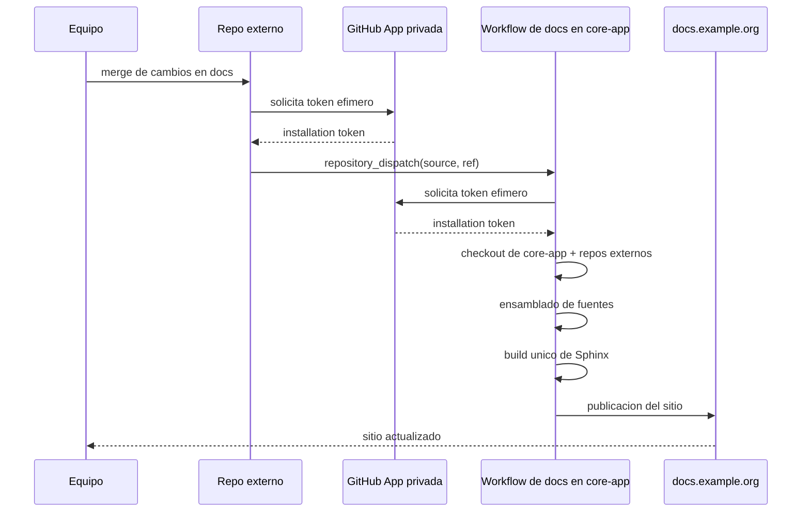

<!--
.. title: Una arquitectura de documentación federada con Sphinx 
.. slug: documentacion-federada-con-sphinx
.. date: 2026-04-28 01:26:03 UTC-03:00
.. tags: docs, sphinx, github-actions, arquitectura, devops
.. category: development
.. link:
.. description: Una arquitectura simple para publicar un único sitio de documentación a partir de fuentes mantenidas en múltiples repositorios.
.. type: text
-->

En varios equipos aparece tarde o temprano el mismo problema: la documentación técnica está repartida entre repositorios distintos, pero el destino natural para publicarla es un solo sitio coherente.

Un proyecto central puede tener su propia documentación de desarrollo, pero además depender de guías operativas, manuales de infraestructura o documentación de integraciones que viven en otros repositorios y son mantenidas por otros equipos.

La pregunta es cómo publicar todo eso junto, sin obligar a centralizar también las fuentes.

La idea que estuvimos implementando estos días en [Fierro](https://www.fierro.com.ar/) es bastante simple: **un único sitio publicado, construido por un único repositorio, a partir de fuentes mantenidas en varios repos**.

<!-- TEASER_END -->

## El escenario

Supongamos un repo principal, `core-app`, que ya publica su documentación con Sphinx en `docs.example.org`.

Ahora queremos sumar dos secciones más:

- `operations/`, cuyo contenido fuente vive en el repo `ops-infra`
- `integrations/`, cuyo contenido fuente vive en el repo `store-connectors`

¿Por qué esta separación de fuentes?  Muchas veces la mantienen distintos equipos
pero también es más útil cuando se consume directamente desde el fuente (por humanos o por agentes, leyendo markdown) que esté "al lado" del código. 

No obstante, para leer "más bonito", generar otros formatos y crossreferenciar (más sobre esto abajo) queremos que el sitio final siga siendo uno solo, con una única publicación y un único dominio.

## La propuesta

En vez de compilar cada repo por separado y luego tratar de "pegar" HTMLs, el enfoque más limpio es ensamblar todo al nivel de las fuentes. La arquitectura quedaría así 

En el ejemplo  `core-app` sigue siendo el ensamblador y publisher del sitio completo. `ops-infra` y `store-connectors` mantienen sólo sus propias fuentes de documentación y en cada build de documentación de `core-app`, el workflow hace checkout de esos repos externos y monta sus `docs/` dentro del árbol que Sphinx va a compilar. Es decir: las fuentes son distribuidas, pero la publicación es centralizada.


## Por qué no compilar cada repo por separado

Una alternativa tentadora es que cada repo genere su propio HTML y luego el repo principal junte "sitios ya cocinados".

El problema es que en ese esquema se mezclan artefactos ya construidos en lugar de trabajar con las fuentes, la navegación integrada se vuelve más incómoda, los links relativos quedan más frágiles y sostener un theme y una estructura comunes pasa a ser bastante más difícil. Además, se duplican decisiones de build que, si de verdad queremos un único sitio, deberían estar concentradas en un solo lugar.

Si el objetivo es tener **un solo sitio**, entonces tiene sentido hacer **una sola compilación**.

## Sanidad en los repos externos

Que la publicación sea centralizada no implica que los repos externos deban quedar "ciegos". Cada docs/ de cada repo debe seguir pudiendo buildear por separado.  Para eso `core-app` define placeholders estables dentro de su propio árbol de docs, por ejemplo:

- `docs/operations/`
- `docs/integrations/`

Durante la build en CI: 

- `ops-infra/docs` reemplaza `docs/operations/`
- `store-connectors/docs` reemplaza `docs/integrations/`

Después Sphinx corre una sola vez sobre ese árbol combinado.

Eso permite que cada equipo itere sobre sus fuentes con feedback rápido, sin depender de correr el pipeline completo del sitio integrado para saber si algo básico se rompió.

La publicación final, sin embargo, sigue ocurriendo sólo desde `core-app`.

## Disparos del pipeline

Hay dos disparadores complementarios:

1. Si cambia la doc del repo principal, `core-app` recompila el sitio completo y trae la versión más reciente de los repos externos.
2. Si cambia la doc en un repo externo, ese repo puede disparar el workflow de `core-app` para forzar una nueva publicación del sitio integrado.

Eso evita una falsa dicotomía entre "publica sólo el repo principal" y "cada repo publica lo suyo".

## Referencias cruzadas entre repos

Cuando cada repo compila su documentación por separado aparece un problema adicional: los links cruzados.

Si `ops-infra` quiere enlazar a un capítulo de `core-app`, o `store-connectors` quiere enlazar a una guía operativa, un enlace interno como `{ref}` o `{doc}` ya no alcanza porque el build local no tiene las fuentes remotas.

Ahí [intersphinx](https://www.sphinx-doc.org/en/master/usage/extensions/intersphinx.html) encaja muy bien, pero en la práctica no hace falta que cada repo externo mantenga snapshots propios de otros inventarios. Si el sitio integrado se compila desde el repo principal, ese mismo build puede generar un único `objects.inv` que ya describe toda la estructura publicada, incluyendo las secciones montadas desde repos externos.

Eso permite un esquema más simple:

- el repo principal genera y versiona su `objects.inv`
- ese inventario ya contiene también los docnames de las secciones externas integradas
- los repos externos consumen ese único inventario desde el repo principal
- los enlaces cruzados se escriben siempre contra el mismo namespace

Por ejemplo, en `ops-infra` se podría tener algo así:

```python
intersphinx_mapping = {
    "core-app": ("https://docs.example.org/", "docs/_intersphinx/core-app.inv"),
}
```

Y después los enlaces se escriben con roles explícitos en MyST, por ejemplo:

```md
Ver la guia principal en {external+core-app:doc}`architecture/index`.

Para el procedimiento operativo relacionado:
{external+core-app:doc}`integrations/webhook-retries`.
```

Con esa convención, los repos externos validan referencias contra la estructura real del sitio integrado, no contra builds parciales. Y si el sitio publicado es privado, no pasa nada: durante el build `intersphinx` usa el archivo local descargado desde el repo principal, mientras que la URL configurada en `intersphinx_mapping` sólo define a dónde apuntan los links finales.

En la práctica, eso termina siendo una muy buena propiedad: las referencias cruzadas se validan tanto en los repos externos como en el ensamblado final, y la convención queda uniforme sin necesidad de mantener inventarios cruzados por separado.

## El flujo en un diagrama

<!--

-->


## Workflows simplificados

La idea se puede implementar con workflows bastante cortos.

### Workflow central

El repo principal sigue siendo el único que compila y publica el sitio completo. El último paso puede adaptarse al mecanismo real de salida que use el equipo:

```yaml
name: Docs

on:
  push:
    branches: [main]
    paths:
      - "docs/**"
      - ".github/workflows/docs.yml"
  workflow_dispatch:
    inputs:
      deploy:
        type: boolean
        default: true
      ops_ref:
        type: string
        required: false
      integrations_ref:
        type: string
        required: false
  repository_dispatch:
    types: [external-docs-updated]

jobs:
  build-docs:
    runs-on: ubuntu-latest
    steps:
      - uses: actions/checkout@v5

      - name: Create app token for external docs
        id: app-token
        uses: actions/create-github-app-token@v3
        with:
          app-id: ${{ vars.DOCS_APP_ID }}
          private-key: ${{ secrets.DOCS_APP_PRIVATE_KEY }}
          owner: acme
          repositories: |
            ops-infra
            store-connectors
          permission-contents: read

      - name: Resolve external refs
        id: refs
        run: |
          if [ "${{ github.event_name }}" = "repository_dispatch" ] && [ "${{ github.event.client_payload.source }}" = "ops-infra" ]; then
            echo "ops_ref=${{ github.event.client_payload.ref }}" >> "$GITHUB_OUTPUT"
            echo "integrations_ref=main" >> "$GITHUB_OUTPUT"
          elif [ "${{ github.event_name }}" = "repository_dispatch" ] && [ "${{ github.event.client_payload.source }}" = "store-connectors" ]; then
            echo "ops_ref=main" >> "$GITHUB_OUTPUT"
            echo "integrations_ref=${{ github.event.client_payload.ref }}" >> "$GITHUB_OUTPUT"
          else
            echo "ops_ref=${{ inputs.ops_ref || 'main' }}" >> "$GITHUB_OUTPUT"
            echo "integrations_ref=${{ inputs.integrations_ref || 'main' }}" >> "$GITHUB_OUTPUT"
          fi

      - uses: actions/checkout@v5
        with:
          repository: acme/ops-infra
          ref: ${{ steps.refs.outputs.ops_ref }}
          path: external-docs/ops-infra
          token: ${{ steps.app-token.outputs.token }}

      - uses: actions/checkout@v5
        with:
          repository: acme/store-connectors
          ref: ${{ steps.refs.outputs.integrations_ref }}
          path: external-docs/store-connectors
          token: ${{ steps.app-token.outputs.token }}

      - uses: astral-sh/setup-uv@v7

      - name: Build docs
        env:
          ENABLE_EXTERNAL_DOCS: "1"
          EXTERNAL_DOCS_OPS_INFRA_DIR: ${{ github.workspace }}/external-docs/ops-infra
          EXTERNAL_DOCS_STORE_CONNECTORS_DIR: ${{ github.workspace }}/external-docs/store-connectors
        run: uv run --group doc inv docs

      - name: Publish site
        if: github.event_name != 'pull_request' && inputs.deploy != false
        run: |
          ./scripts/publish-docs.sh
```

### Workflow de sanidad en un repo externo

Cada repo externo valida sus fuentes localmente:

```yaml
name: Validate docs

on:
  pull_request:
    paths:
      - "docs/**"
      - "Makefile"
      - ".github/workflows/docs.yml"
  push:
    paths:
      - "docs/**"
      - "Makefile"
      - ".github/workflows/docs.yml"

jobs:
  build-docs:
    runs-on: ubuntu-latest
    steps:
      - name: Create app token to read central inventory
        id: app-token
        uses: actions/create-github-app-token@v3
        with:
          app-id: ${{ vars.DOCS_APP_ID }}
          private-key: ${{ secrets.DOCS_APP_PRIVATE_KEY }}
          owner: acme
          repositories: |
            core-app
          permission-contents: read
      - uses: actions/checkout@v5
      - name: Checkout central objects.inv
        uses: actions/checkout@v5
        with:
          repository: acme/core-app
          ref: main
          path: core-docs
          token: ${{ steps.app-token.outputs.token }}
          sparse-checkout: |
            docs/_intersphinx/core-app.inv
          sparse-checkout-cone-mode: false
      - uses: astral-sh/setup-uv@v7
      - env:
          INTERSPHINX_CORE_APP_INVENTORY: ${{ github.workspace }}/core-docs/docs/_intersphinx/core-app.inv
        run: make docs
```

### Workflow de dispatch en un repo externo

Si el repo externo mergea cambios en docs, puede pedirle al pipeline central que republique el sitio integrado:

```yaml
name: Publish docs in central site

on:
  workflow_run:
    workflows: ["Validate docs"]
    types: [completed]
  workflow_dispatch:

jobs:
  dispatch-central-docs:
    if: |
      github.event_name == 'workflow_dispatch' ||
      (github.event_name == 'workflow_run' &&
       github.event.workflow_run.conclusion == 'success' &&
       github.event.workflow_run.event == 'push' &&
       github.event.workflow_run.head_branch == 'main')
    runs-on: ubuntu-latest
    steps:
      - name: Create app token for dispatch
        id: app-token
        uses: actions/create-github-app-token@v3
        with:
          app-id: ${{ vars.DOCS_APP_ID }}
          private-key: ${{ secrets.DOCS_APP_PRIVATE_KEY }}
          owner: acme
          repositories: |
            core-app
          permission-contents: write
      - name: Trigger central docs workflow
        env:
          GH_TOKEN: ${{ steps.app-token.outputs.token }}
        run: |
          if [ "${{ github.event_name }}" = "workflow_dispatch" ]; then
            REF="${{ github.ref_name }}"
          else
            REF="${{ github.event.workflow_run.head_branch }}"
          fi

          curl -sS -X POST \
            -H "Accept: application/vnd.github+json" \
            -H "Authorization: Bearer ${GH_TOKEN}" \
            https://api.github.com/repos/acme/core-app/dispatches \
            -d @- <<JSON
          {
            "event_type": "external-docs-updated",
            "client_payload": {
              "source": "ops-infra",
              "ref": "${REF}"
            }
          }
          JSON
```

## Autenticación entre repos

La primera versión de esta arquitectura puede resolverse con un PAT compartido, pero no me parece la mejor parada para sostenerlo.

Una GitHub App privada de la organización deja el esquema bastante más sano:

- el repo central pide tokens efímeros sólo para leer los repos externos
- cada repo externo pide tokens efímeros sólo para disparar `repository_dispatch` al repo central
- no hay credenciales persistentes reutilizadas entre repos
- la futura evolución hacia webhooks o automatizaciones propias de la app queda servida

En este caso alcanza con permisos bastante acotados. Para que `core-app` pueda hacer checkout de `ops-infra` y `store-connectors`, la app necesita permiso de repositorio `Contents: Read` sobre esos repos. Para que un repo externo pueda disparar `POST /repos/{owner}/{repo}/dispatches` en `core-app`, necesita `Contents: Write` sobre el repo principal.

Crear la app también es bastante directo. En la organización hay que ir a `Settings -> Developer settings -> GitHub Apps -> New GitHub App`, darle un nombre, dejarla como privada si sólo se va a usar dentro de la org, configurar los permisos mínimos anteriores y luego crearla. Después se genera una private key, se guarda el `App ID` como variable de Actions, la clave privada como secret, y finalmente se instala la app sólo en los repos que tiene que tocar: `core-app`, `ops-infra` y `store-connectors`, idealmente con selección explícita y no sobre todos los repos de la organización.

El truco práctico en los workflows sigue siendo simple: guardar `APP_ID` como variable y la private key como secret, y generar installation tokens en cada job con `actions/create-github-app-token`.

## Lo que me gusta de esta idea

Me gusta porque resuelve una tensión habitual sin mucha ceremonia:

- no fuerza un monorepo documental
- no multiplica sitios
- no duplica pipelines de publicación
- no obliga a mover ownership de contenido

Cada equipo conserva su repo, su workflow y su contexto, pero el resultado visible sigue siendo un único portal de documentación.

Me parece una solución especialmente razonable para organizaciones donde un sistema principal convive con repos satélite de infraestructura, integraciones, tooling o despliegue.

## El principio de fondo

Si varios equipos mantienen capítulos distintos de una misma historia técnica, no hace falta elegir entre "todo junto en un repo" y "todo desparramado en sitios separados".

Se puede tener:

- **fuentes federadas**
- **build central**
- **publicación única**

Y, muchas veces, esa combinación es justo el punto de equilibrio que estábamos necesitando.
